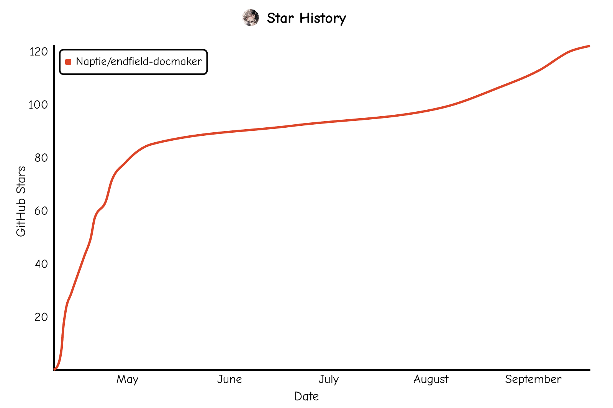

<div align="center">

# 终末地文档生成器

**用于生成《明日方舟：终末地》游戏世界观中各机构签发的文档的工具**

[](https://svelte.dev)
[](https://typst.app)
[](https://tailwindcss.com)
[](https://www.typescriptlang.org)

</div>

> [!IMPORTANT]
> 该工具仅供娱乐与学习交流之用，请在合理、合法的范围内使用。  
> 该工具本身无法在不修改代码的前提下仿造真实文件或真实存在的机构签发的文件。  
> 因对该工具的不合理使用而产生的任何直接或间接责任、损失或纠纷，使用者自行承担。  
> 他人对该仓库代码作出的任何改动、由此产生的风险或后果均与该仓库所有者无关。

## 功能特性

- 在浏览器中实时生成 PDF 文件，无需后端服务
- 支持多个模板，每个模板分别支持数个自定义参数
- 试卷模板自动根据单题分数计算板块总分与整卷总分
- 公文模板自动生成带有随机偏移和旋转的圆形公章
- 基于 Typst 排版引擎，内容区域支持 Typst 标记语法
- PDF 实时预览、在新标签页中打开、下载
- 表单内容自动持久化至浏览器本地存储
- 字体文件自动缓存至浏览器 IndexedDB
- 可在设置页面管理字体、一键清空数据
- 明暗主题切换
- 中英双语界面

## 部署

- GitHub Pages: https://naptie.github.io/endfield-docmaker/
- Cloudflare: https://endfield-docmaker.phi.zone/
- Vercel: https://endfield.phi.zone/docmaker/

## 技术栈

| 层级     | 技术                                                                                               |
| -------- | -------------------------------------------------------------------------------------------------- |
| 框架     | [SvelteKit](https://svelte.dev) + [Svelte 5](https://svelte.dev/docs/svelte/overview) (Runes 模式) |
| 排版引擎 | [Typst](https://typst.app) (通过 WebAssembly 在浏览器中运行)                                       |
| 组件库   | [shadcn-svelte](https://www.shadcn-svelte.com) + [Bits UI](https://bits-ui.com)                    |
| 样式     | [Tailwind CSS 4](https://tailwindcss.com)                                                          |
| 国际化   | [Paraglide JS](https://inlang.com/m/gerre34r/library-inlang-paraglideJs) (Inlang)                  |
| 图标     | [Phosphor](https://phosphoricons.com) + [Lucide](https://lucide.dev)                               |
| 构建工具 | [Vite](https://vite.dev)                                                                           |
| 部署     | 静态站点 (`@sveltejs/adapter-static`)                                                              |

## 项目结构

```
endfield-docmaker/
├── messages/
│   ├── en.json                     # 英文本地化文本
│   └── zh.json                     # 中文本地化文本
├── scripts/
│   └── manage-messages.ts          # i18n 文案管理脚本
├── src/
│   ├── routes/
│   │   ├── +layout.svelte          # 根布局
│   │   ├── +layout.ts              # 根布局加载逻辑
│   │   ├── +page.svelte            # 主页面（表单 + PDF 预览）
│   │   └── layout.css              # 全局样式与主题变量
│   └── lib/
│       ├── constants.ts            # 常量定义
│       ├── index.ts                # 公共导出
│       ├── tint.ts                 # 颜色处理
│       ├── typst.svelte.ts         # Typst WASM 初始化与编译逻辑
│       ├── utils.ts                # 工具函数
│       ├── hooks/                  # 业务 hooks
│       ├── assets/
│       │   ├── fonts/              # 字体资源
│       │   ├── logos/              # 机构 Logo
│       │   └── typst/
│       │       ├── official-doc.typ  # 红头文件模板
│       │       └── tuzhang.typ       # 圆形公章生成器
│       ├── components/
│       │   ├── DateInput.svelte    # 日期输入组件
│       │   ├── Footer.svelte       # 页脚
│       │   ├── LocaleSwitch.svelte # 语言切换
│       │   ├── ThemeToggle.svelte  # 明暗主题切换
│       │   └── ui/                 # shadcn-svelte 组件
│       └── paraglide/              # i18n 生成文件
└── package.json
```

## 本地开发

```bash
# 安装依赖
pnpm install

# 启动开发服务器
pnpm dev

# 类型检查
pnpm check

# 格式化 + 检查
pnpm fl

# 构建静态站点
pnpm build
```

## 致谢

- [ParaN3xus](https://github.com/ParaN3xus) — 红头公文模板 (`official-doc.typ`)
- [Lonyou](https://github.com/Vkango) — 圆形公章模板 (`tuzhang.typ`)
- [Cuilb](https://www.xiaohongshu.com/user/profile/5ed7a1e1000000000101cef8) — 罗德岛、宏科院、联盟工团、环塔商会矢量复刻 Logo
- [ezexam](https://github.com/gbchu/ezexam) — 试卷模板
- [typst.ts](https://github.com/Myriad-Dreamin/typst.ts) — [Typst](https://typst.app) WebAssembly 编译器
- [shadcn-svelte](https://www.shadcn-svelte.com) — UI 组件库

## 星标历史

<picture>
  <source media="(prefers-color-scheme: dark)" srcset=".github/assets/star-history/star-history-dark.svg">
  <source media="(prefers-color-scheme: light)" srcset=".github/assets/star-history/star-history-light.svg">
  
</picture>
